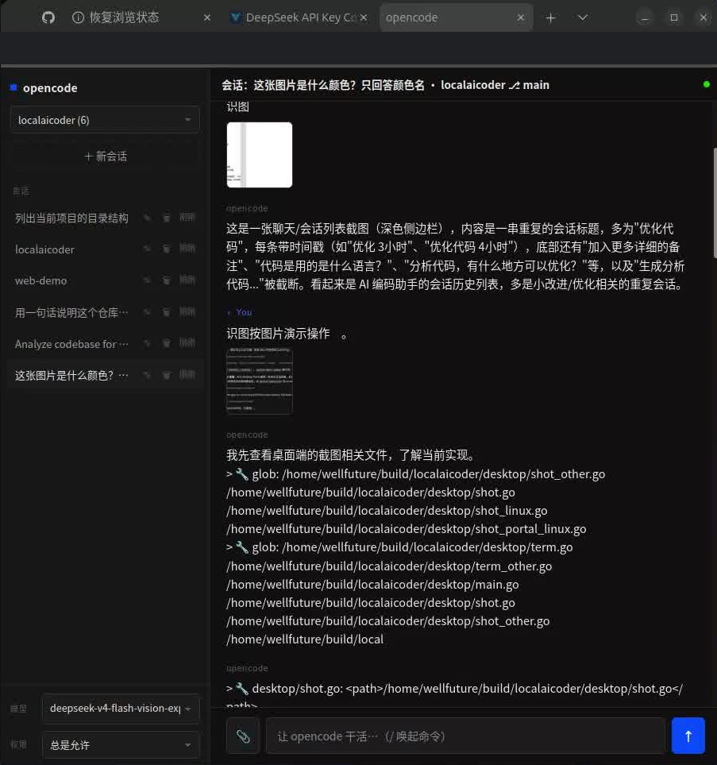

English | [中文](README.zh-CN.md)

# Switchboard

> Drive the **opencode** running on your home PC from your phone — from anywhere.

Switchboard is a tiny two-piece system for remote AI development. Your code, environment,
git repos and model keys all live on your home machine — so the agent that "does the work"
must run there. Switchboard makes that machine reachable from any browser, without opening
a single inbound port on your home network:

- **Remotely use opencode for real development** — send prompts, watch streaming replies
  and tool calls, upload screenshots, approve file writes, switch models/projects.
- **Zero inbound ports at home.** The bridge on your home PC makes an *outbound*
  WebSocket connection to your VPS; NAT and firewalls stay untouched.
- **A dumb-pipe relay on the VPS.** The relay only checks a device token and forwards
  JSON frames — it neither parses nor stores your traffic, and it knows nothing about
  opencode. Swap the controlled backend and only the bridge changes.

## Demo

Open `https://your.domain/s/?d=<token>` on your phone and the home PC is at your fingertips:



*The phone console in action: project/session list on the left, chat on the right. This
session uploaded a screenshot and asked a vision question; opencode answers while its
tool calls (`glob …`) stream into the transcript. Model picker and permission mode sit
at the bottom — everything you see is executed by opencode on the home PC; the phone
only sends frames and renders the stream.*

## Architecture

```
┌────────────┐  HTTPS/WSS   ┌───────── Public VPS ─────────┐   outbound WS   ┌──── Your server (home PC) ────┐
│   Phone    │ ──────────> │  Nginx (443)                  │ <───────────── │  bridge  pc/opencode_bridge.py │
│  browser   │             │    └─> relay service/main.py  │                │    │ HTTP + SSE                │
└────────────┘             │        (127.0.0.1:9000)       │                │    ▼                           │
                            └───────────────────────────────┘                │  opencode serve               │
                                                                              │  (127.0.0.1:9001)             │
                                                                              └───────────────────────────────┘
```

| Piece | Runs on | Role |
|---|---|---|
| Phone console (`service/page.html`) | Anywhere | Single-page console served by the relay — no build step |
| Nginx | VPS | The only public entry: TLS + reverse proxy + WebSocket/SSE passthrough |
| Relay (`service/main.py`) | VPS, loopback only | **Dumb pipe**: validates the device token and forwards frames (broadcast up, single-forward down) |
| Bridge (`pc/opencode_bridge.py`) + `opencode serve` | **Your server (home PC)** | Bridge translates phone frames ↔ opencode HTTP/SSE; opencode does the actual work |

Why "dumb pipe"? The relay is deliberately mute — it **never parses, never caches, never
produces** content. It only routes frames by `device_token`. That keeps the public attack
surface logic-free, makes the relay reusable for any backend, and pushes all translation
logic into the bridge on your own machine.

## Repository layout

```
switchboard/
├── service/            # deploy to the VPS
│   ├── main.py         # relay (FastAPI, ~300 lines)
│   ├── page.html, css/, js/   # phone console
│   ├── config.json.example
│   ├── requirements.txt
│   └── nginx.conf.example     # annotated Nginx site config
├── pc/                 # stays on your home PC
│   ├── opencode_bridge.py     # protocol-translating bridge
│   └── opencode_bridge.json.example
├── README.md / README.zh-CN.md          # overview (EN / 中文)
├── README-opencode.en.md / -opencode.md # usage guide (EN / 中文)
├── ARTICLE.en.md / ARTICLE.md           # technical deep-dive (EN / 中文)
├── config.en.md / config.md             # config fields + deployment (EN / 中文)
└── TUNNEL-3STEPS.en.md / -3STEPS.md     # official UI via SSH tunnel (EN / 中文)
```

Every document exists in both English (`.en.md`) and Chinese (no suffix); each file
links to its twin at the top.

## Quick start

**Home PC** (needs [opencode](https://opencode.ai) installed):

```bash
opencode serve --hostname 127.0.0.1 --port 9001
cp pc/opencode_bridge.json.example pc/opencode_bridge.json   # fill in relay URL + token
python3 pc/opencode_bridge.py --config pc/opencode_bridge.json
```

**VPS**:

```bash
scp -r service/ root@YOUR_VPS:/opt/switchboard
cd /opt/switchboard && python3 -m venv .venv && .venv/bin/pip install -r requirements.txt
cp config.json.example config.json    # listen: 127.0.0.1:9000, token: openssl rand -hex 32
# install nginx.conf.example, then run under systemd (unit in config.en.md)
```

Open `https://your.domain/s/?d=<token>` on your phone. Full deployment walkthrough:
[config.en.md](config.en.md).

## Security model

Three credentials, each guarding one segment:

| Credential | Where it lives | What it protects |
|---|---|---|
| Provider API key | Home PC (`opencode` auth) | Your LLM billing — never leaves the home network |
| `OPENCODE_SERVER_PASSWORD` | Home PC + bridge config | opencode's HTTP API (bridge holds it via HTTP Basic) |
| Device token (`openssl rand -hex 32`) | VPS whitelist + bridge + phone URL | The relay's only authentication — **the token is the control channel**; rotate on leak |

Plus the ground rules: the relay binds to loopback only, an empty token whitelist rejects
everything, permission requests fail closed (timeout ⇒ deny), and — since the relay sees
plaintext frames — **run it on a VPS you trust**, i.e. your own.

## Documentation

- [ARTICLE.en.md](ARTICLE.en.md) — how and why it works: relay, dumb pipe, bridge
  internals, streaming/permission/reconnect design, Nginx directives that prevent
  classic failures
- [README-opencode.en.md](README-opencode.en.md) — usage guide: Plan A (self-hosted
  console) vs Plan B (official opencode UI), protocol translation, permissions
- [config.en.md](config.en.md) — every configuration field, systemd + Nginx deployment,
  troubleshooting
- [TUNNEL-3STEPS.en.md](TUNNEL-3STEPS.en.md) — alternative: expose the official opencode
  web UI through an SSH reverse tunnel behind the same Nginx setup

Chinese versions: [ARTICLE.md](ARTICLE.md) · [README-opencode.md](README-opencode.md) ·
[config.md](config.md) · [TUNNEL-3STEPS.md](TUNNEL-3STEPS.md)
